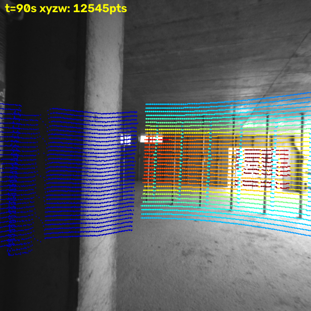
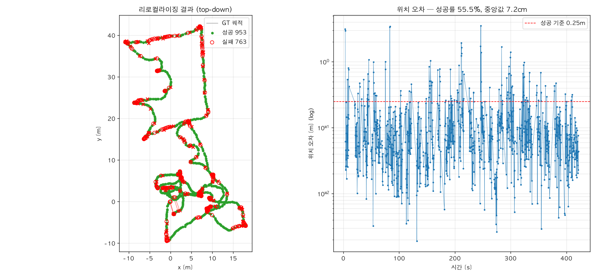

# LIO_VisualReloc

**LiDAR SLAM으로 맵을 만들고, 카메라 한 장으로 그 맵에서 위치를 찾는다.**

밑바닥부터 만든 두 프로젝트를 서브모듈로 묶은 통합 시스템:

| 서브모듈 | 역할 | 스택 |
|---|---|---|
| [Cpp_SLAM](https://github.com/MyungJewon/Cpp_SLAM) | LiDAR(-Inertial) SLAM — 정확한 기하와 궤적 | C++, VGICP, ScanContext, iSAM2 |
| [VSLAM_repository](https://github.com/MyungJewon/VSLAM_repository) | CPU 시각 리로컬라이징 — 이미지 한 장 → 6DOF | Python, XFeat, MegaLoc, PnP |

> 철학: *정확한 기하는 LiDAR에서, 인식은 카메라에서.*
> 두 서브모듈은 파일 인터페이스(TUM 궤적)로만 대화하고 서로의 코드를 수정하지 않는다.

## 파이프라인

```
rosbag ──► Cpp_SLAM ──► slam_trajectory.tum ──► build_db (이미지+포즈 태깅)
                                                    │
                              쿼리 사진 1장 ──► localize ──► 6DOF 포즈
```

1. **LiDAR SLAM**: bag의 점군+IMU로 궤적 추정, 최적화 포즈를 TUM으로 내보냄
2. **DB 구축**: 같은 bag의 카메라 이미지에 SLAM 포즈를 태깅
   (카메라-라이다 외부파라미터로 환원), GT-포즈 삼각측량으로 특징점별 3D 부여
3. **리로컬라이징**: 쿼리 → MegaLoc 검색 → XFeat 매칭 → PnP — 전부 CPU

## 결과 (Hilti 2021 exp02_construction_multilevel)

공사장 실내, PandarXT-32 + Alphasense 5캠 + IMU, 430초 주행.

### LiDAR SLAM 정확도 (GT 컨트롤 포인트 22개, ATE)

| 구성 | ATE 평균 | 최대 |
|---|---|---|
| 순수 LiDAR (IMU off) | 1.87m | 6.24m |
| IMU 타이트커플링 (축 미보정) | 8.60m | 20.25m |
| **IMU + 외부회전 보정 (`--imu-rot`)** | **1.23m** | **2.22m** |

핵심 발견: 이 장비는 IMU(Alphasense)와 LiDAR(Pandar)가 **90° 돌아가고 뒤집혀**
장착돼 있다. IMU 샘플을 라이다 축으로 회전시키지 않으면 관성 정보가 오염되어
오히려 크게 악화된다(8.6m). 외부회전 한 줄을 보정하자 순수 LiDAR 대비
**평균 34%, 최대 오차 65% 개선** — "IMU 통합이 나쁜 게 아니라 외부파라미터가
없었던 것"임을 정량 증명.

캘리브 검증은 라이다 점군을 카메라에 투영해 확인 (색=깊이, 구조 일치):



### 리로컬라이징 (자체 SLAM 포즈 기반 맵, GT 불사용)

held-out 쿼리 1,716장 — DB에 없는 중간 프레임으로 "사진 한 장 → 위치":

**성공률 55.5% (<0.25m & <5°), 중앙값 위치오차 7.2cm**



읽는 법: 채점 기준 자체가 SLAM 궤적(절대오차 ~1.2m 내포)이므로 이 수치는
"SLAM 맵 좌표계 안에서의 자기 일관성"이다. 중앙값 7.2cm는 리로컬라이징
파이프라인이 GT 기반 실험(Hilti 2026 floor_2: 94%/1.6cm)과 같은 급으로
작동함을 보여주며, 성공률 차이는 저해상도 흑백(0.4MP)·계단·무텍스처
콘크리트라는 장면 난이도에서 온다.

## 실행

```bash
# 0. (lz4 압축 bag이면) 라이다+IMU만 비압축으로 변환
python scripts/decompress_bag.py <입력.bag> data/lidar_imu.bag /hesai/pandar /alphasense/imu

# 1~3. SLAM → DB → 평가 (개별 실행 권장, scripts/run_pipeline.sh 참고)
Cpp_SLAM/build/slam data/lidar_imu.bag /hesai/pandar /alphasense/imu \
    --imu --imu-rot 0.7071068,-0.7071068,0,0
python -m src.build_db configs/hilti2021.yaml    # VSLAM_repository에서
python -m src.eval     configs/hilti2021.yaml --limit 40

# SLAM 궤적 정확도 (GT 컨트롤 포인트 대비)
python scripts/eval_ate.py <slam.tum> configs/exp02_gt_control_points.txt
```

## 구조

```
Cpp_SLAM/           서브모듈 — LiDAR SLAM (실행 바이너리는 원본 레포에서 빌드)
VSLAM_repository/   서브모듈 — 시각 리로컬라이징 (venv는 원본 레포)
configs/            데이터셋별 설정 + 캘리브 + GT 컨트롤 포인트
scripts/            decompress_bag.py · eval_ate.py · run_pipeline.sh
data/, output/      (gitignore) bag과 산출물
```

서브모듈 운영 규칙: 이 레포에서 서브모듈 내부를 수정하지 않는다.
수정은 각 원본 레포에서 → push → 여기서 `git submodule update --remote` + 커밋
(= "이 조합으로 검증했다"는 기록).

## 로드맵

- [x] Cpp_SLAM TUM 궤적 내보내기 (출력 포트)
- [x] IMU→LiDAR 외부회전(`--imu-rot`) — ATE 1.87→1.23m
- [x] SLAM 포즈 기반 이미지 DB + 리로컬라이징 (M5, 중앙값 7.2cm)
- [ ] 시각 루프 제안 → SLAM 포즈그래프 입력 포트 (매핑 강화)
- [ ] 색 점군/메쉬 — 카메라 이미지를 LiDAR 맵에 투영해 텍스처링
- [ ] 다중 세션 DB 병합
